<link rel="stylesheet" href="css/bootstrap.min.css">
<link rel="stylesheet" type="text/css" href="css/style.css">

 
 

 
<h3 id="name" class="p-0 m-0 mb-1">Eleanor M. Lin</h3>

elealin@umich.edu 
[GitHub](https://github.com/emlinking) 
[Google Scholar](https://scholar.google.com/citations?user=Jidk2_wAAAAJ&hl=en) 
[LinkedIn](https://www.linkedin.com/in/eleanor-lin)

I am a first-year [Computer Science and Engineering](https://cse.engin.umich.edu/) PhD student at the University of Michigan, advised by [David Jurgens](https://jurgens.people.si.umich.edu/). I obtained my BA at Columbia University, double-majoring in linguistics and computer science. I am primarily interested in natural language processing. At Columbia's [Speech Lab](http://www.cs.columbia.edu/speech/index.cgi), I researched code-switching under the mentorship of Professor [Julia Hirschberg](http://www.cs.columbia.edu/~julia/). I have also researched the use of large language models for the study of negotiation at the University of Southern California's [Affective Computing Lab](https://emotions.ict.usc.edu/), where I was advised by Professor [Jonathan Gratch](https://people.ict.usc.edu/~gratch/). Previously, working with Professor [Vicente Ordóñez Román](https://www.cs.rice.edu/~vo9/) in the [Vision, Language, and Learning Lab](https://vislang.ai/) at Rice University, I investigated the relationship between images' visual complexity and image descriptions' linguistic complexity. Working with [Dr. Kate Moore](https://www.linkedin.com/in/kate-moore-644aab9) in the Corter Lab at Columbia's Teachers College, I have also researched communication patterns in collaborative learning. You can find my curriculum vitae [here](files/Eleanor_Lin_CV_Updated_June_2025.pdf).

* TOC
{:toc}

## Publications
### Refereed Publications

	<ul class="list-unstyled">
		<li class="media">
			
			

			

				Switching Tongues, Sharing Hearts: Identifying the Relationship between Empathy and Code-switching in Speech 
			
				Debasmita Bhattacharya*, <u>Eleanor Lin</u>*, Run Chen, and Julia Hirschberg.
			
			
				<i>INTERSPEECH 2024.</i> Kos Island, Greece. *DB and EL are equal contributors to this work and are designated as co-first authors.
			
				[<a href="https://www.isca-archive.org/interspeech_2024/bhattacharya24_interspeech.pdf">Paper</a>] 
			

			

		</li>
	</ul>

<!-- /.blog-post -->

	<ul class="list-unstyled">
		<li class="media">
			
			

			

				Detecting Empathy in Speech 
			
				Run Chen, Haozhe Chen, Anushka Kulkarni, <u>Eleanor Lin</u>, Linda Pang, Divya Tadimeti, Jun Shin, and Julia Hirschberg.
			
			
				<i>INTERSPEECH 2024.</i> Kos Island, Greece.
			
				[<a href="https://www.isca-archive.org/interspeech_2024/chen24f_interspeech.html">Paper</a>] 
			

			

		</li>
	</ul>

<!-- /.blog-post -->

	<ul class="list-unstyled">
		<li class="media">
			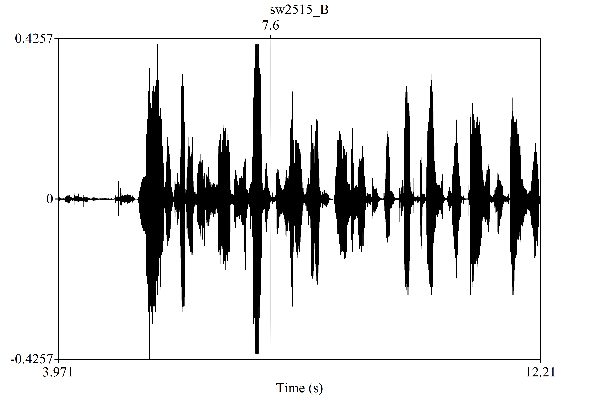
			

			

				<a class="blue_link" href="https://www.cs.columbia.edu/speech/PaperFiles/2024/iwsds24_raswda_paper.pdf">RASwDA: Re-Aligned Switchboard Dialog Act Corpus for Dialog Act Prediction in Conversation</a> 
			
				Run Chen, <u>Eleanor Lin</u>, Shayan Hooshmand, Mariam Mustafa, Rose Sloan, Ritika Nandi, Alicia Yang, Andrea Lopez, Ansh Kothary,
Isaac Suh, Catherine Lyu, Eric Chen, Sophia Horng, and Julia Hirschberg.
			
			
				 <i>International Workshop on Spoken Dialogue
Systems Technology.</i> Sapporo, Japan. Accepted as poster presentation.
			
			[<a href="https://www.cs.columbia.edu/speech/PaperFiles/2024/iwsds24_raswda_paper.pdf">Paper</a>] 
			

			

		</li>
	</ul>

<!-- /.blog-post -->

	<ul class="list-unstyled">
		<li class="media">
			
			

			

				<a class="blue_link" href="https://doi.org/10.1145/3565287.3617637">
					Toward a Better Understanding of the Emotional Dynamics of Negotiation with Large Language Models
				</a>  
				
					<u>Eleanor Lin</u>, James Hale, and Jonathan Gratch.
				
				
					 In <i>The Twenty-fourth International Symposium on Theory, Algorithmic Foundations, and Protocol Design for Mobile Networks and Mobile Computing (MobiHoc ’23), October 23–26, 2023, Washington, DC, USA.</i> ACM, New York, NY, USA, 6 pages. Accepted as oral presentation. https://doi.org/10.1145/3565287.3617637
				
				[<a href="files/negotiation_paper.pdf">Paper</a>] [<a href="files/REUNS 2023 .pptx">Slides</a>] [<a href="images/llm_nego.png">Poster</a>]
			

			

		</li>
	</ul>

<!-- /.blog-post -->

### Thesis

	<ul class="list-unstyled">
		<li class="media">
			
			

			

				Developing Performant Models for Translating Spoken Taiwanese Into Spoken English Using Free and Publicly Available Resources 
			
				<u>Eleanor Lin</u>.
			
			
				 Columbia University Program of Linguistics, April 2024. Undergraduate thesis.
			
				[<a href="files/thesis.pdf">Thesis</a>]
			

			

		</li>
	</ul>

<!-- /.blog-post -->

### Working Papers and Preprints

## Presentations

	<ul class="list-unstyled">
		<li class="media">
			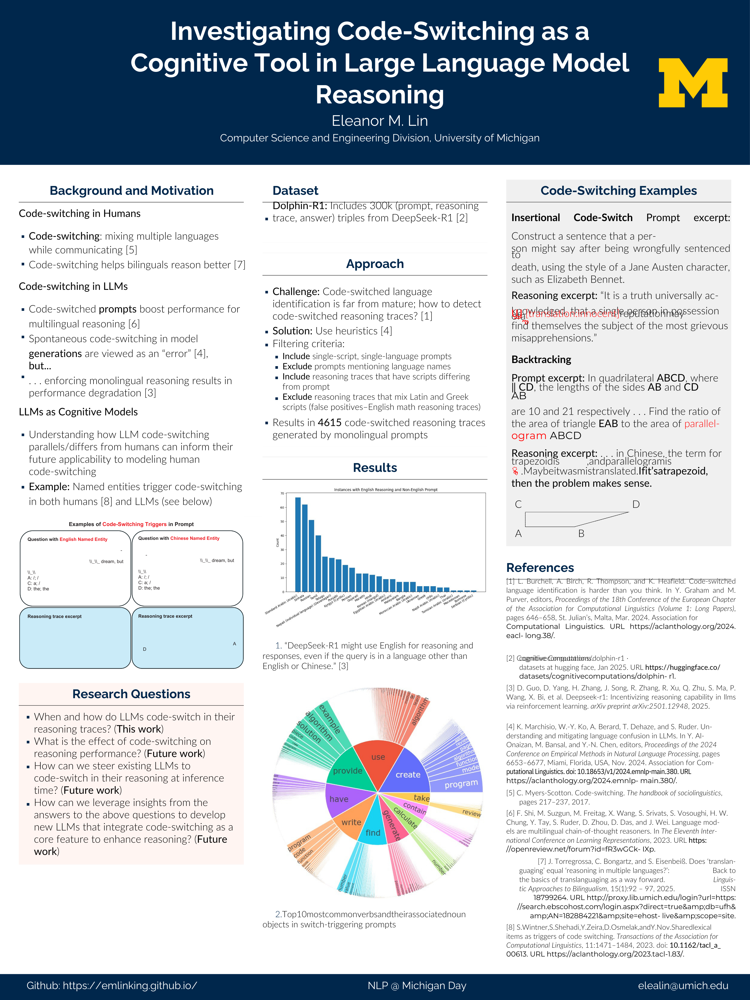
			

			

					Investigating Code-Switching as a Cognitive Tool in Large Language Model Reasoning 
				
					<u>Eleanor Lin</u> and David Jurgens.
				
				
					NLP @ Michigan Day, Ann Arbor, MI, March 2025. Poster presentation.
				
				[<a href="files/UMich_NLP_Day_Poster-2.pdf">Poster</a>] 
			

			

		</li>
	</ul>

<!-- /.blog-post -->

	<ul class="list-unstyled">
		<li class="media">
			
			

			

					Instilling discipline in LLM-based negotiating agents 
				
					James Hale, <u>Eleanor Lin</u>, Ian Wu, Zora Rong, Kushal Chawla, Gale Lucas, and Jonathan Gratch.
				
				
					Annual Conference of the International Association for Conflict Management (IACM), Singapore, June 2024. Symposium talk.
				
			

			

		</li>
	</ul>

<!-- /.blog-post -->

	<ul class="list-unstyled">
		<li class="media">
			
			

			

				<a class="blue_link" href="files/eulc_slides.pdf">
					Toward a Sociolinguistic Profile of Taiwanese Americans
				</a> 
				
					<u>Eleanor Lin</u>.
				
				
					Emory Undergraduate Linguistics Conference, Online, April 2024. Oral presentation.
				
				[<a href="files/Toward_a_Sociolinguistic_Profile_of_Taiwanese_Americans.pdf">Working Paper</a>] 
				[<a href="files/eulc_slides.pdf">Slides</a>] 
			

			

		</li>
	</ul>

<!-- /.blog-post -->

	<ul class="list-unstyled">
		<li class="media">
			
			

			

				<a class="blue_link" href="files/dreu_report.pdf">
					Text-Based Prediction of Visual Complexity: How Does What We See Influence What We Say?
				</a> 
				
					<u>Eleanor Lin</u>, Ziyan Yang, and Vicente Ordóñez.
				
				
					Columbia University Undergraduate Research Symposium, New York, NY, October 2022. Poster presentation.
				
				[<a href="files/dreu_report.pdf">Report</a>] 
				[<a href="files/dreu_slides.pdf">Slides</a>] 
				[<a href="files/poster_visual_complexity_lin_2022.pdf">Poster</a>] 
				[<a href="https://github.com/emlinking/visual-complexity">Code</a>]
				[<a href="https://emlinking.github.io/blog/">Project Blog</a>]
			

			

		</li>
	</ul>

<!-- /.blog-post -->

## Grants, Awards, and Academic Honors

	<ul class="list-unstyled">
		<li class="media">
			
			

			

				Graduate Research Fellowship, National Science Foundation, 2025 
				
					<i>Selected through competitive application process to receive 3 years of financial support toward graduate study (acceptance rate ~15%). 1500 students total were selected nationwide (with 10 selected specifically from the discipline of natural language processing).</i>
				
			

			

		</li>
	</ul>

<!-- /.blog-post -->

	<ul class="list-unstyled">
		<li class="media">
			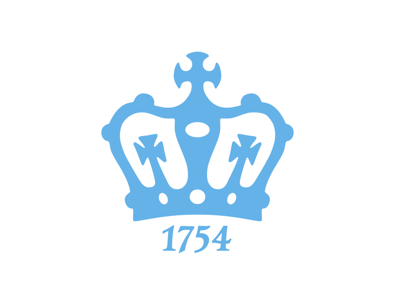
			

			

				Departmental Honors in Linguistics, Columbia University Program of Linguistics, 2024 
				
					<i>One of two graduating linguistics majors selected for honors, on the basis of the quality of the senior thesis.</i>
				
			

			

		</li>
	</ul>

<!-- /.blog-post -->

	<ul class="list-unstyled">
		<li class="media">
			
			

			

				Computer Science Scholarship Award, Columbia University Department of Computer Science, 2024 
				
					<i>One of two B.A. candidates selected annually on the basis of “outstanding academic achievement in computer science."</i>
				
			

			

		</li>
	</ul>

<!-- /.blog-post -->

	<ul class="list-unstyled">
	<li class="media">
		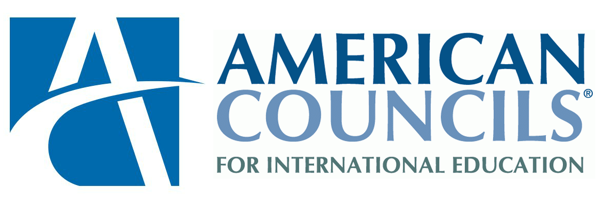
		

			

				Fulbright-Hays Group Projects Abroad (GPA) Fellowship for Advanced Overseas Chinese Language Study, American Councils for International Education, 2024 
				
					<i>Awarded $7000 to cover cost of attendance for Taiwan Intensive Summer Language Program. Conducted post-program outreach: organized information session in partnership with Columbia University Undergraduate Global Engagement, presented study abroad opportunities to 27 students in 2 undergraduate Chinese language classes at the University of Michigan, authored blog post for American Councils' website.</i>
				
			

		

	</li>
	</ul>

<!-- /.blog-post -->

	<ul class="list-unstyled">
	<li class="media">
		
		

			

			Dean's List, Columbia College, Expected 2020 - 2024
			

			

		</li>
	</ul>

<!-- /.blog-post -->

	<ul class="list-unstyled">
	<li class="media">
		
		

			

			Work Exemption Program Grant, Columbia University, 2024 
				
					<i>Recipient of $1,820 Columbia Grant to support pursuit of research in the Columbia Speech Lab.</i>
				
			

			

		</li>
	</ul>

<!-- /.blog-post -->

	<ul class="list-unstyled">
		<li class="media">
			
			

			

				<a class="blue_link" href="https://cra.org/crae/awards/cra-outstanding-undergraduate-researchers/">Outstanding Undergraduate Researcher Award - Honorable Mention</a>, Computing Research Association, 2023 
				
				
			

			

		</li>
	</ul>

<!-- /.blog-post -->

	<ul class="list-unstyled">
		<li class="media">
			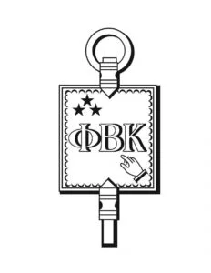
			

			

				<a class="blue_link" href="https://www.college.columbia.edu/news/class-2024-junior-phi-beta-kappa-initiates-announced">Junior Phi Beta Kappa</a>, Columbia University, 2023 
				
					<i>Awarded to 2% of the Columbia College Class of 2024 (26 students) in recognition of breadth, depth, and rigor in scholarship</i>
				
			

			

		</li>
	</ul>

<!-- /.blog-post -->

	<ul class="list-unstyled">
		<li class="media">
			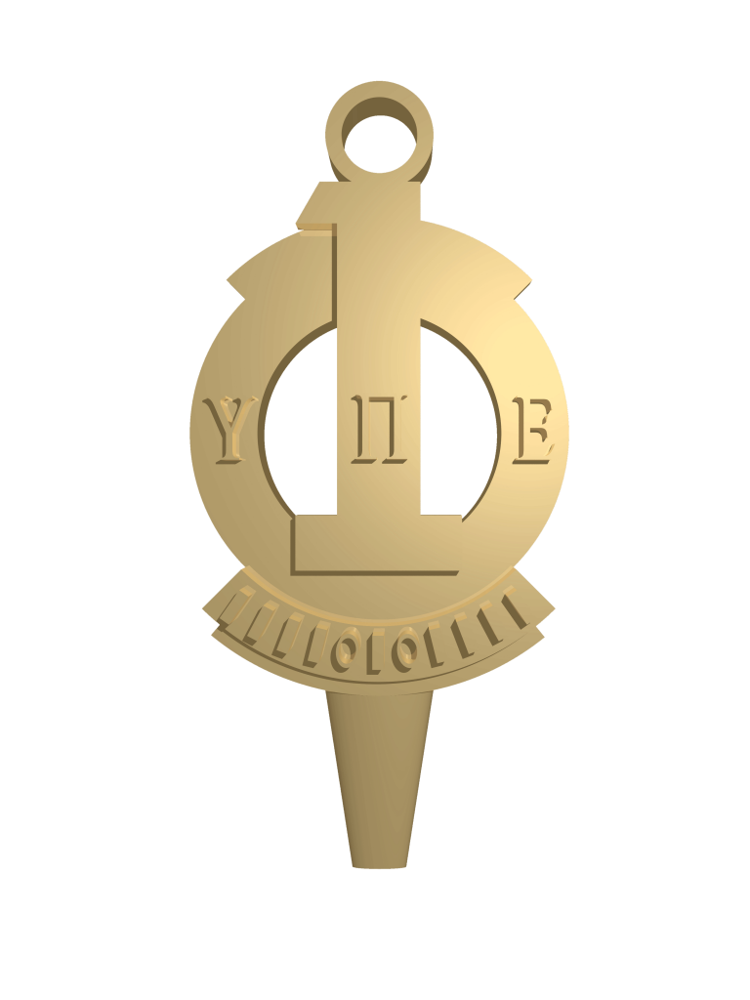
			

			

				<a class="blue_link" href="https://upe.acm.org/">Upsilon Pi Epsilon (International Honor Society for the Computing and Information Disciplines)</a> Member, Columbia University, 2023 
				
					<i>Awarded in recognition of GPA in the top 15% of computer and information science juniors and seniors at Columbia</i>
				
			

			

		</li>
	</ul>

<!-- /.blog-post -->

	<ul class="list-unstyled">
		<li class="media">
			
			

			

				REU Travel Grant, National Science Foundation, 2023 
				
					<i>Awarded $1200 to attend MobiHoc '23 and present my paper, <a class="blue_link" href="https://doi.org/10.1145/3565287.3617637">Toward a Better Understanding of the Emotional Dynamics of Negotiation with Large Language Models</a>.
					</i>
				
			

			

		</li>
	</ul>

<!-- /.blog-post -->

	<ul class="list-unstyled">
	<li class="media">
			
			

			

				NSF Research Experiences for Undergraduates Intern, University of Southern California, 2023
			

			

	</li>
</ul>

<!-- /.blog-post -->

	<ul class="list-unstyled">
	<li class="media">
		
		

			

				Distributed Research Experiences for Undergraduates Intern, Computing Research Association, 2022 
			
				<i>Awarded $7000 to conduct research at Rice University with Professor Vicente Ordóñez Román.</i>
			
			

		

	</li>
</ul>

<!-- /.blog-post -->

	<ul class="list-unstyled">
	<li class="media">
			
		

			

				<a class="blue_link" href="https://research.google/outreach/csrmp/recipients/?category=2021">Computer Science Research Mentorship Program Scholar</a>, Google, 2021
			

		

	</li>
</ul>

<!-- /.blog-post -->

## Research Experience

	<ul class="list-unstyled">
		<li class="media">
			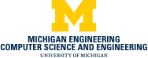
			

			

			<a class="blue_link" href="https://blablablab.si.umich.edu/">Blablablab</a>, Department of Electrical Engineering and Computer Science, University of Michigan, Ann Arbor, MI 
			
				<i>Graduate Student Research Assistant</i>, August 2024 - Present | <i>Adviser:</i> David Jurgens
			 
			
				 Conduct research at the intersection of NLP, computational social science, and sociolinguistics.
			
			

			

		</li>
	</ul>

<!-- /.blog-post -->

	<ul class="list-unstyled">
		<li class="media">
			
			

			

			<a class="blue_link" href="http://www.cs.columbia.edu/speech/index.cgi">Speech Lab</a>, Department of Computer Science, Columbia University, New York, NY 
			
				<i>Research Assistant</i>, January 2022 - May 2024 | <i>Adviser:</i> Julia Hirschberg
			 
			
				 Investigated relationship between empathy and code-switching by detecting empathetic utterances
in code-switched speech, using RoBERTa fine-tuned for empathy detection. Investigated relationship between dialog acts and code-switching, by adapting dialog act annotation scheme to better suit, and annotating dialog acts on, code-switched speech. Wrote script to fine-tune Wav2Vec2 for end-to-end dialog act classification on Switchboard Dialog Act Corpus, using PyTorch and Hugging Face Transformers. Contributed to multimodal, multilingual empathetic speech corpus by processing video, audio, text with Jupyter Notebooks, Praat, FFmpeg.
			
			

			

		</li>
	</ul>

<!-- /.blog-post -->

	<ul class="list-unstyled">
		<li class="media">
			
			

			

			<a class="blue_link" href="https://emotions.ict.usc.edu/">Affective Computing Lab</a>, Institute for Creative Technologies, University of Southern California, Los Angeles, CA 
			
				<i>Research Experiences for Undergraduates (REU) Intern</i>, May 2023 - August 2023 | <i>Adviser:</i> Jonathan Gratch
			 
			
				 Developed negotiating agent for online studies of human negotiation behaviors. Engineered large language model prompts for agent NLU/NLG with OpenAI API. Built user interface using HTML, CSS, JavaScript, Flask. Assembled Qualtrics survey for crowdworkers to evaluate agent.
			
			

			

		</li>
	</ul>

<!-- /.blog-post -->

	<ul class="list-unstyled">
		<li class="media">
			
			

			

			<a class="blue_link" href="https://vislang.ai/">Vision, Language, and Learning Lab</a>, Department of Computer Science, Rice University, Houston, TX 
			
				<i>Distributed Research Experiences for Undergraduates (DREU) Intern</i>, May 2022 - July 2022 | <i>Adviser:</i> Vicente Ordóñez Román
			 
			
				 Quantified visual and linguistic complexity in MSCOCO image captioning dataset by creating and applying novel visual complexity metric, then fine-tuning BERT to predict visual complexity from image captions. Probed and mitigated content-related biases in resulting models.
			
			

			

		</li>
	</ul>

<!-- /.blog-post -->

	<ul class="list-unstyled">
		<li class="media">
			
			

			

			<a class="blue_link" href="http://www.cs.columbia.edu/nlp/index_nltp.cgi">Natural Language Text Processing Lab</a>, Department of Computer Science, Columbia University, New York, NY 
			
				<i>Data Annotator</i>, October 2021 – December 2021 | <i>Adviser:</i> Fei-Tzin Lee
			 
			
				 Generated semantic annotations for text generation/summarization in the literary domain.
			
			

			

		</li>
	</ul>

<!-- /.blog-post -->

	<ul class="list-unstyled">
		<li class="media">
			
			

			

			<a class="blue_link" href="http://www.columbia.edu/~jec34/">Corter Lab</a>, Department of Human Development, Columbia University, New York, NY 
			
				<i>Research Assistant</i>, March 2021 - June 2021 | <i>Adviser:</i> Katherine Moore
			 
			
				 Identified communication strategies in collaborative learning dialogues by annotating speech acts
and analyzing <i>n</i>-gram frequencies with R. Assisted with onboarding new research assistants. [<a href="https://github.com/emlinking/collaborative-learning.git">Code</a>]
			
			

			

		</li>
	</ul>

<!-- /.blog-post -->

## Course Projects

	<ul class="list-unstyled">
		<li class="media">
			
			

			

			COMS W4705: Natural Language Processing, Image Captioning System 
			
				May 2023
			 
			
				 Implemented image captioning system trained on Flickr 8k dataset, using Inception V3 (for feature extraction) and bidirectional LSTM.
			
			

			

		</li>
	</ul>

<!-- /.blog-post -->

	<ul class="list-unstyled">
		<li class="media">
			
			

			

			LING GU4120: Language Documentation and Field Methods, Documenting the Sakha Language 
			
				January 2023 - May 2023
			 
			
			Elucidated and documented the phonology, morphology, and syntax of the Sakha language by interviewing native speaker and analyzing collected transcriptions and audio recordings. 
			
				[<a href="files/phonology.pdf">Report on Sakha Phonology</a>] 
				[<a href="files/nouns.pdf">Report on Sakha Nominal Morphology and Syntax</a>] 
				[<a href="files/verbs_clauses.pdf">Report on Sakha Verbal Morphology and Clausal Syntax</a>] 
				[<a href="files/texts.pdf">Analysis of Two Sakha Texts</a>]
			

			

		</li>
	</ul>

<!-- /.blog-post -->

	<ul class="list-unstyled">
		<li class="media">
			
			

			

			COMS W4705: Natural Language Processing, Dependency Parser 
			
				April 2023
			 
			
				 Implemented neural network dependency parser using Keras API of TensorFlow and trained on WSJ subset of Penn Treebank corpus to achieve a macro average unlabeled attachment score of 76.17.
			
			

			

		</li>
	</ul>

<!-- /.blog-post -->

	<ul class="list-unstyled">
		<li class="media">
			
			

			

			COMS W4701: Artificial Intelligence, American Sign Language Alphabet Recognition Model 
			
				December 2022
			 
			
				 Designed and implemented convolutional neural network using Keras API of TensorFlow to interpret images of American Sign Language letters with 92.2% accuracy.
			
			

			

		</li>
	</ul>

<!-- /.blog-post -->

## Teaching Experience

	<ul class="list-unstyled">
		<li class="media">
			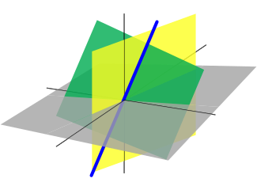
			

			

			Columbia COMS4771: Machine Learning, New York, NY 
			
				<i>Course Assistant</i>, January 2024 - May 2024
			 
			
				 Introduction to machine learning. Held office hours, took attendance, monitored class discussion board, and graded
assignments.
			
			

			

		</li>
	</ul>

<!-- /.blog-post -->

	<ul class="list-unstyled">
		<li class="media">
			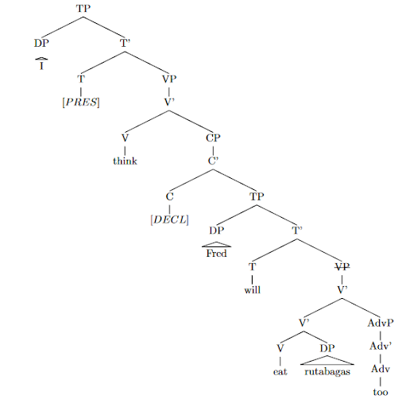
			

			

			Columbia LING4903: Syntax, New York, NY 
			
				<i>Teaching Assistant</i>, September 2023 - December 2023
			 
			
				 Introduction to modern formal theories of syntax. Held office hours, took attendance, and graded
assignments.
			
			

			

		</li>
	</ul>

<!-- /.blog-post -->

	<ul class="list-unstyled">
		<li class="media">
			
			

			

			<a class="blue_link" href="https://www.cs.columbia.edu/~djhsu/coms3251-f22/">Columbia COMS3251: Computational Linear Algebra</a>, New York, NY 
			
				<i>Course Assistant</i>, September 2022 - December 2022
			 
			
				 Introduction to linear algebra and its applications to data analysis. Hosted weekly office hours,
moderated class discussion board, graded homework assignments, proctored final exam.
			
			

			

		</li>
	</ul>

<!-- /.blog-post -->

	<ul class="list-unstyled">
		<li class="media">
			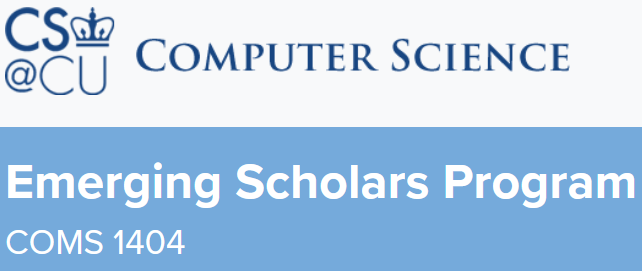
			

			

			<a class="blue_link" href="https://www.cs.columbia.edu/esp/">Columbia COMS1404: Emerging Scholars Program Seminar</a>, New York, NY 
			
				<i>Workshop Assistant</i>, September 2021 – May 2022
			 
			
				 Facilitated introductory computer science seminar to increase retention of diverse undergraduates. Moderated discussions, took attendance, and emailed weekly announcements.
			
			

			

		</li>
	</ul>

<!-- /.blog-post -->

## Journalism

	<ul class="list-unstyled">
		<li class="media">
			
			

			

			<a class="blue_link" href="https://www.michigandaily.com/author/elealin/">The Michigan Daily</a>, Ann Arbor, MI 
			
				<i>Statement Correspondent</i>, May 2025 – July 2025
			 
			
				 Authored two ~2000-word ledes and one ~1600-word secondary article for The Statement, the long-form magazine of <em>The Michigan Daily</em>, University of Michigan's independent student-run newspaper. Pitched stories, conducted interviews, coordinated with editors, contributed photography, and performed archival research. [<a class="blue_link" href="https://www.michigandaily.com/author/elealin/">Articles</a>]
			
			

			

		</li>
	</ul>

<!-- /.blog-post -->

	<ul class="list-unstyled">
		<li class="media">
			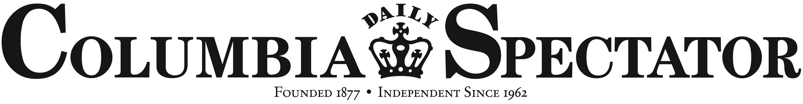
			

			

			<a class="blue_link" href="https://www.columbiaspectator.com/contributors/Eleanor-Lin/">Columbia Daily Spectator</a>, New York, NY 
			
				<i>Graphics Deputy Editor</i>, January 2022 – May 2022
			 
			
				 Reported stories incorporating data analysis and visualization using Python, Adobe Illustrator, HTML, and CSS. Co-authored article on disparities in access to healthy food in local area, including interactive map of food sources. Provided data visualizations for article on COVID-19 vaccination rate disparities between different demographic groups. Recruited and trained reporters in data journalism. [<a class="blue_link" href="https://www.columbiaspectator.com/contributors/Eleanor-Lin/">Articles</a>]
			
			

			

		</li>
	</ul>

<!-- /.blog-post -->

	<ul class="list-unstyled">
		<li class="media">
			
			

			

			<a class="blue_link" href="https://www.columbiaspectator.com/contributors/Eleanor-Lin/">Columbia Daily Spectator</a>, New York, NY 
			
				<i>Graphics Trainee</i>, October 2021 – December 2021
			 
			
				 Reported story on student mental health in online communities, including communicating methodology and results of social media data analysis. [<a class="blue_link" href="https://www.columbiaspectator.com/contributors/Eleanor-Lin/">Articles</a>]
			
			

			

		</li>
	</ul>

<!-- /.blog-post -->

	<ul class="list-unstyled">
		<li class="media">
			
			

			

			<a class="blue_link" href="https://www.columbiaspectator.com/contributors/Eleanor-Lin/">Columbia Daily Spectator</a>, New York, NY 
			
				<i>Summer Fellow</i>, July 2020
			 
			
				Pitched, wrote, and published ~3,000-word feature in <i>The Eye</i> magazine, working on a two-week deadline. Conferred with editors,
conducted background research, interviewed 6 sources, and wrote article. [<a class="blue_link" href="https://www.columbiaspectator.com/contributors/Eleanor-Lin/">Articles</a>]
			
			

			

		</li>
	</ul>

<!-- /.blog-post -->

## Science Communication

	<ul class="list-unstyled">
		<li class="media">
			
			

			

			<a class="blue_link" href="https://www.thecolumbiasciencereview.com/">Columbia Science Review</a>, New York, NY 
			
				<i>Writer</i>, September 2020 – December 2021
			 
			
				Wrote biweekly articles on topics including environmental science, computational social science, biochemistry, and
mathematics.
			
			

			

		</li>
	</ul>

<!-- /.blog-post -->

	<ul class="list-unstyled">
		<li class="media">
			
			

			

			<a class="blue_link" href="https://www.thecolumbiasciencereview.com/">Columbia Science Review</a>, New York, NY 
			
				<i>COVID-19 Public Hub Co-Leader</i>, October 2020 – May 2021
			 
			
				Launched Instagram account (@csrcovidhub) to provide Columbia-relevant COVID-19 information to 200+
followers.
			
			

			

		</li>
	</ul>

<!-- /.blog-post -->

## Extracurricular and Volunteer Experience

	<ul class="list-unstyled">
		<li class="media">
			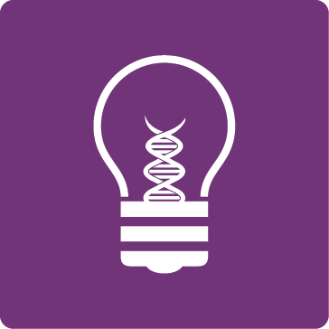
			

			

			Engaging Scientists in Policy and Advocacy, Ann Arbor, MI 
			
				<i>Secretary and Social Media Coordinator</i>, July 2025 - Present
			 
			
				Keep accurate records to ensure continuity of ESPA's institutional memory, so that we can also continuously improve our initiatives. Ensure timely communication of relevant opportunities to members. Increase ESPA's public visibility, furthering our mission of fostering publicly engaged science and science communication. Foster useful collaborations and connections between ESPA and aligned organizations/individuals via social media.
			
			

			

		</li>
	</ul>

<!-- /.blog-post -->

	<ul class="list-unstyled">
		<li class="media">
			
			

			

			Café con Ling, Virtual 
			
				<i>Mentor</i>, December 2024 - Present
			 
			
				Mentor current undergraduates in the Columbia University Linguistics Program, through student-led mentoring program which provides by-appointment office hours.
			
			

			

		</li>
	</ul>

<!-- /.blog-post -->

	<ul class="list-unstyled">
		<li class="media">
			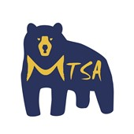
			

			

			<a class="blue_link" href="https://sites.google.com/a/umich.edu/mtsa-wiki/home">Michigan Taiwanese Student Association </a>, Ann Arbor, MI 
			
				<i>Volunteer</i>, August 2024 – Present
			 
			
				Build community among Taiwanese graduate students at the University of Michigan by assisting operations and providing transportation at
monthly social events.
			
			

			

		</li>
	</ul>

<!-- /.blog-post -->

	<ul class="list-unstyled">
		<li class="media">
			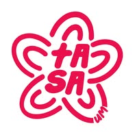
			

			

			<a class="blue_link" href="https://www.facebook.com/tasaumich/">University of Michigan Taiwanese American Student Association</a>, Ann Arbor, MI 
			
				<i>Big/Little Mentorship Program Mentor</i>, September 2024 – April 2025
			 
			
				Mentored 1 current University of Michigan undergraduate, providing academic and career advice and participating in community-building activities.
			
			

			

		</li>
	</ul>

<!-- /.blog-post -->

	<ul class="list-unstyled">
		<li class="media">
			
			

			

			<a class="blue_link" href="https://commonread.engin.umich.edu/cre-selection-committee/">University of Michigan College of Engineering</a>, Ann Arbor, MI 
			
				<i>Common Reading Experience Book Selection Committee Volunteer</i>, November 2024 - Present
			 
			
				Review 2 books to facilitate the process of selecting a book for the University of Michigan College of Engineering's Common Reading Experience, which aims to foster community, non-technical skills, and curiosity among engineering students. Provide feedback via surveys and group discussion.
			
			

			

		</li>
	</ul>

<!-- /.blog-post -->

	<ul class="list-unstyled">
		<li class="media">
			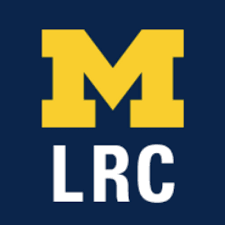
			

			

			<a class="blue_link" href="https://lsa.umich.edu/lrc/translation/languagebank.html">University of Michigan Language Resource Center</a>, Ann Arbor, MI 
			
				<i>Language Bank Program Volunteer</i>, November 2024 - Present
			 
			
				Translate documents from English to Mandarin Chinese for University of Michigan departments/schools and external non-profit organizations.
			
			

			

		</li>
	</ul>

<!-- /.blog-post -->

	<ul class="list-unstyled">
		<li class="media">
			
			

			

			<a class="blue_link" href="https://gradsweatum.wixsite.com/gradswe">University of Michigan Graduate Society of Women Engineers</a>, Ann Arbor, MI 
			
				<i>Outreach Volunteer</i>, August 2024 - Present
			 
			
				Served on graduate school information panel sharing insights with undergraduates on applying to graduate school, finding undergraduate research opportunities, and developing mentoring relationships. Conducted K-12 outreach with Community Action Network by volunteering for museum visit serving children from under-resourced families in Washtenaw County.
			
			

			

		</li>
	</ul>

<!-- /.blog-post -->

	<ul class="list-unstyled">
		<li class="media">
			
			

			

			<a class="blue_link" href="https://cseg-michigan.github.io/">University of Michigan Computer Science and Engineering Graduate Students</a>, Ann Arbor, MI 
			
				<i>Member</i>, August 2024 - Present
			 
			
				Advised computer science PhD applicant by providing detailed feedback on application materials, as well as general advice about the application process, through the Student Application Support Program. Hosted Tea Time social hour to build community among graduate students.
			
			

			

		</li>
	</ul>

<!-- /.blog-post -->

	<ul class="list-unstyled">
		<li class="media">
			
			

			

			<a class="blue_link" href="https://www.college.columbia.edu/alumni/odyssey-mentoring?src=vol">Columbia College Alumni Association</a>, Virtual 
			
				<i>Odyssey Mentoring Program Mentor</i>, October 2024 - December 2024
			 
			
				Mentored 1 Columbia College undergraduate through holistic discussion of academics, career paths, and personal goals.
			
			

			

		</li>
	</ul>

<!-- /.blog-post -->

	<ul class="list-unstyled">
		<li class="media">
			
			

			

			<a class="blue_link" href="https://cse.engin.umich.edu/">University of Michigan Computer Science and Engineering Division</a>, Ann Arbor, MI 
			
				<i>Building Bridges in CSE PhD Studies Volunteer</i>, October 2024 - November 2024
			 
			
				Conducted outreach to underrepresented undergraduates by delivering talk introducing my research and the U-M CSE graduate program at Florida International University. Hosted one-on-one coffee chats with prospective computer science graduate school applicants.
			
			

			

		</li>
	</ul>

<!-- /.blog-post -->

	<ul class="list-unstyled">
		<li class="media">
			
			

			

			<a class="blue_link" href="https://girlsencoded.eecs.umich.edu/discoverCS/">University of Michigan Computer Science and Engineering Division</a>, Ann Arbor, MI 
			
				<i>EECS 110: Discover Computer Science Interview Volunteer</i>, September 2024 - November 2024
			 
			
				Volunteered to be interviewed by a current student in EECS 110: Discover Computer Science, a course designed to introduce underrepresented students to computer science. Provided student interviewer with perspectives on potential CS career paths, graduate school, research, and internships.
			
			

			

		</li>
	</ul>

<!-- /.blog-post -->

	<ul class="list-unstyled">
		<li class="media">
			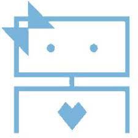
			

			

			<a class="blue_link" href="https://cuwics.github.io/">Columbia University Women in Computer Science</a>, New York, NY 
			
				<i>Academic Committee Co-Lead</i>, August 2023 - May 2024
			 
			
				Organized academic-related programming to support gender-diverse Columbia University computer science students, including workshops on course selection and lunches with female computer science professors. Hosted weekly coffee chats to provide students with advising on computer science internships, research, and courses. 
			
			

			

		</li>
	</ul>

<!-- /.blog-post -->

	<ul class="list-unstyled">
		<li class="media">
			
			

			

			<a class="blue_link" href="https://www.adicu.com/mentorship">Columbia University Application Development Initiative</a>, New York, NY 
			
				<i>Mentor for Computer Science Mentorship Program</i>, October 2022 - December 2023
			 
			
				Supported 2 Columbia University undergraduates majoring in computer science with one-on-one academic and preprofessional advising.
			
			

			

		</li>
	</ul>

<!-- /.blog-post -->

	<ul class="list-unstyled">
		<li class="media">
			
			

			

			<a class="blue_link" href="https://cuwics.github.io/">Columbia University Women in Computer Science</a>, New York, NY 
			
				<i>Community Committee Chair</i>, August 2022 - May 2023
			 
			
				Organized activities focused on building a gender-diverse community of Columbia University computer science students, including an information session introducing the technical interview process, as well as social activities such as arts and crafts nights. Hosted weekly coffee chats to provide students with advising on computer science internships, research, and courses. 
			
			

			

		</li>
	</ul>

<!-- /.blog-post -->

 Website design inspired by <a href="https://jr4fs.github.io/">jr4fs.github.io</a>.

 
 
