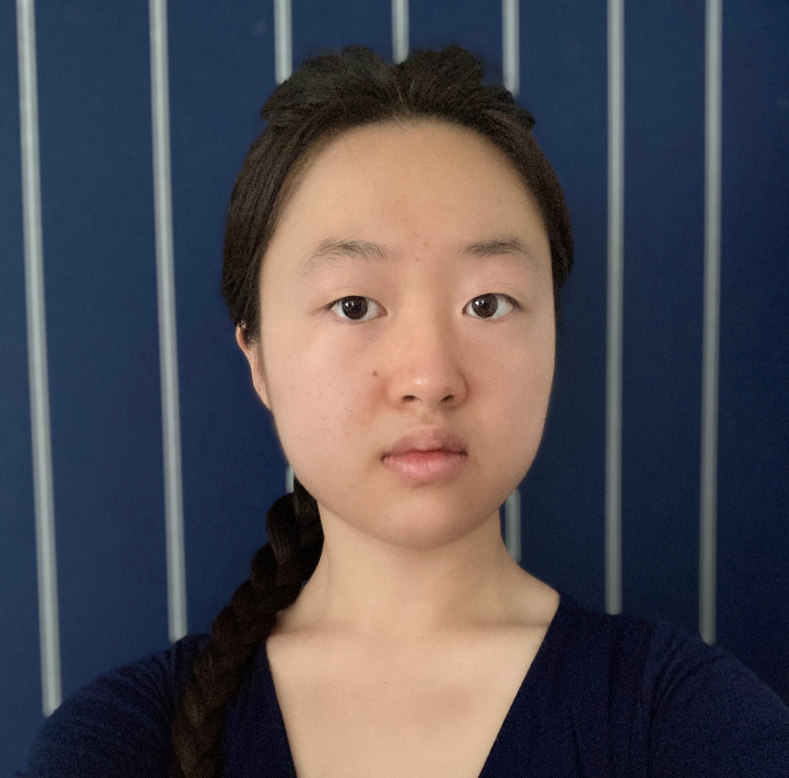

**Eleanor M. Lin**  
B. A. Candidate, Computer Science and Linguistics  
[Department of Computer Science](https://www.cs.columbia.edu/) and [Program of Linguistics](https://slavic.columbia.edu/content/linguistics)  
Columbia University  
e.lin2@columbia.edu

I am a senior double-majoring in linguistics and computer science at Columbia University. At Columbia's Speech Lab, I currently research code-switching, under the mentorship of Professor [Julia Hirschberg](http://www.cs.columbia.edu/~julia/). Recently, I researched the use of large language models for the study of negotiation at the University of Southern California's [Affective Computing Lab](https://emotions.ict.usc.edu/), where I was advised by Professor [Jonathan Gratch](https://people.ict.usc.edu/~gratch/). Previously, working with Professor [Vicente Ordóñez-Román](https://www.cs.rice.edu/~vo9/) in the [Vision, Language, and Learning Lab](https://vislang.ai/) at Rice University, I investigated the relationship between images' visual complexity and image descriptions' linguistic complexity. Working with [Dr. Kate Moore](https://www.linkedin.com/in/kate-moore-644aab9) in the [Corter Lab](https://www.tc.columbia.edu/faculty/jec34/) at Columbia's Teachers College, I have also researched communication patterns in collaborative learning. I am primarily interested in natural language processing.

* TOC
{:toc}

## Publications

## Presentations

## Research Experience

## Teaching Experience
