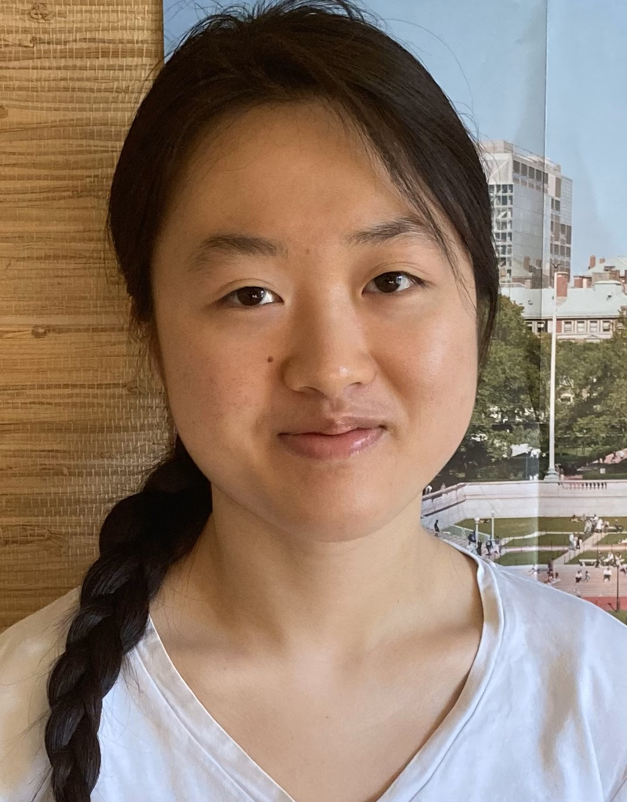
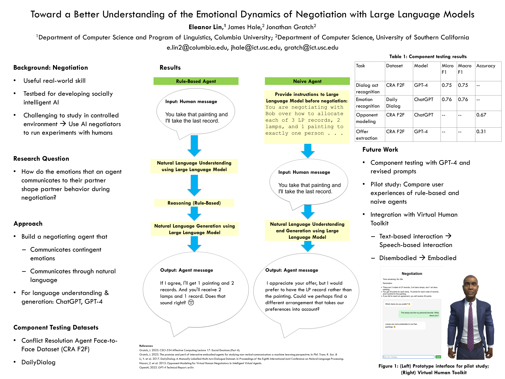
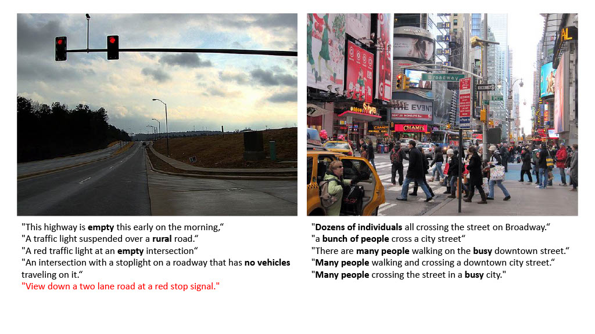
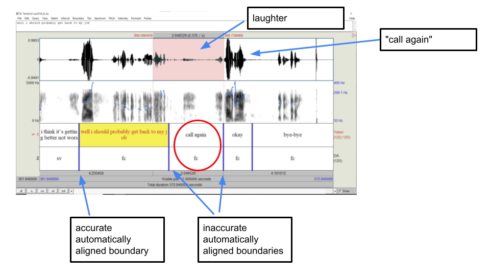
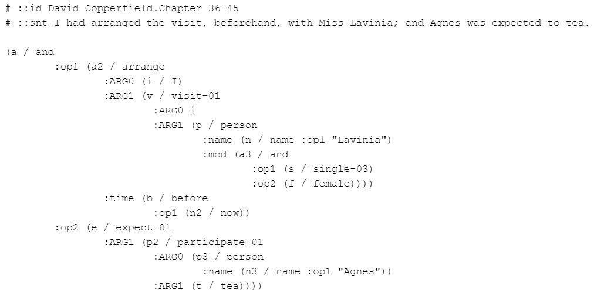
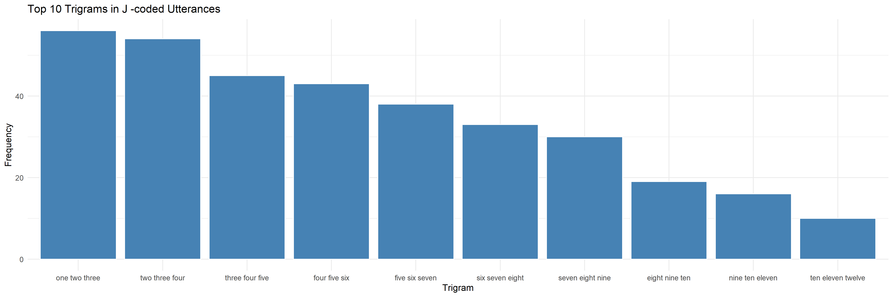
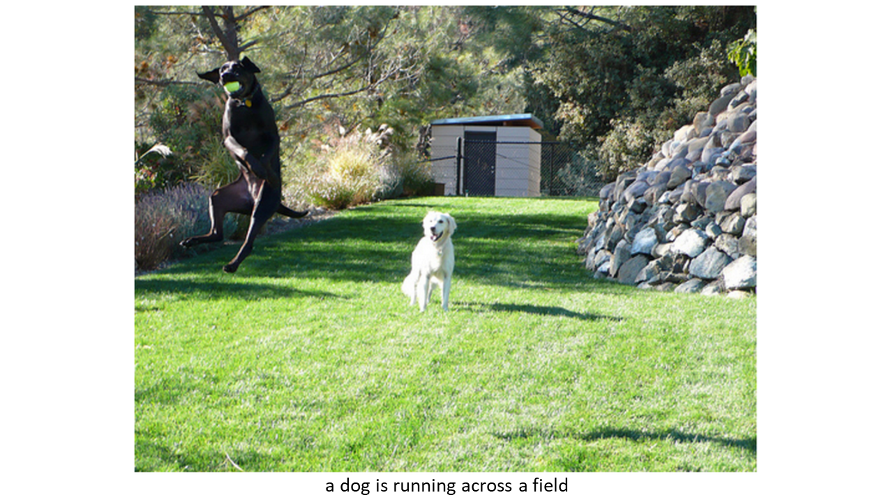
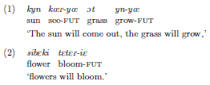
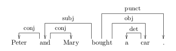
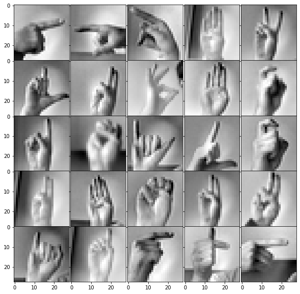

<link rel="stylesheet" href="css/bootstrap.min.css">
<link rel="stylesheet" type="text/css" href="css/style.css">

 
 

 
<h3 id="name" class="p-0 m-0 mb-1">Eleanor M. Lin</h3>

B. A. Candidate, Computer Science and Linguistics  
[Department of Computer Science](https://www.cs.columbia.edu/) and [Program of Linguistics](https://slavic.columbia.edu/content/linguistics)  
Columbia University  
e.lin2@columbia.edu

I am a senior double-majoring in linguistics and computer science at Columbia University. I am primarily interested in natural language processing. At Columbia's [Speech Lab](http://www.cs.columbia.edu/speech/index.cgi), I currently research code-switching, under the mentorship of Professor [Julia Hirschberg](http://www.cs.columbia.edu/~julia/). Recently, I researched the use of large language models for the study of negotiation at the University of Southern California's [Affective Computing Lab](https://emotions.ict.usc.edu/), where I was advised by Professor [Jonathan Gratch](https://people.ict.usc.edu/~gratch/). Previously, working with Professor [Vicente Ordóñez Román](https://www.cs.rice.edu/~vo9/) in the [Vision, Language, and Learning Lab](https://vislang.ai/) at Rice University, I investigated the relationship between images' visual complexity and image descriptions' linguistic complexity. (You can read more about my research at Rice, which was funded through the Distributed Research Experiences for Undergraduates Program, on my [project blog](blog.html).) Working with [Dr. Kate Moore](https://www.linkedin.com/in/kate-moore-644aab9) in the [Corter Lab](https://www.tc.columbia.edu/faculty/jec34/) at Columbia's Teachers College, I have also researched communication patterns in collaborative learning. You can find my curriculum vitae [here](files/Eleanor_Lin_CV_Updated_September_2023.pdf).

* TOC
{:toc}

## Publications

	<ul class="list-unstyled">
		<li class="media">
			
			

			

			<a class="blue_link" href="https://doi.org/10.1145/3565287.3617637">
				Toward a Better Understanding of the Emotional Dynamics of Negotiation with Large Language Models
			</a> 
			
				<u>Eleanor Lin</u>, James Hale, and Jonathan Gratch
			
			
				 In <i>The Twenty-fourth International Symposium on Theory, Algorithmic Foundations, and Protocol Design for Mobile Networks and Mobile Computing (MobiHoc ’23), October 23–26, 2023, Washington, DC, USA.</i> ACM, New York, NY, USA, 6 pages. 
			
			[<a href="https://doi.org/10.1145/3565287.3617637">Paper</a>] 
			

			

		</li>
	</ul>

<!-- /.blog-post -->

## Presentations

	<ul class="list-unstyled">
		<li class="media">
			
			

			

				<a class="blue_link" href="files/dreu_report.pdf">
					Text-Based Prediction of Visual Complexity: How Does What We See Influence What We Say?
				</a> 
				
					<u>Lin, E.</u>, Yang, Z., & Ordóñez, V.
				
				
					Columbia University Undergraduate Research Symposium, New York, NY, October 2022. 
				
				[<a href="files/dreu_report.pdf">Report</a>] 
				[<a href="files/dreu_slides.pdf">Slides</a>] 
				[<a href="files/poster_visual_complexity_lin_2022.pdf">Poster</a>] 
				[<a href="https://github.com/emlinking/visual-complexity">Code</a>]
			

			

		</li>
	</ul>

<!-- /.blog-post -->

## Awards

	<ul class="list-unstyled">
		<li class="media">
			

			

			REU Travel Grant, National Science Foundation, 2023 
			
				<i>Awarded $1200 to attend MobiHoc '23 and present my paper, <a class="blue_link" href="https://doi.org/10.1145/3565287.3617637">Toward a Better Understanding of the Emotional Dynamics of Negotiation with Large Language Models</a>.</i>
			
			

			 
			

			Dean's List, Columbia College, 2020 – Present 
			

				 
			

				NSF Research Experiences for Undergraduates Intern, University of Southern California, 2023
			
 
			

				Fulbright-Hays Scholarship (Declined), American Councils for International Education, 2023 
			
				<i>Awarded $7915 to cover cost of attendance for Taiwan Intensive Summer Language Program.</i>
			
			
 
			

				Distributed Research Experiences for Undergraduates Intern, Computing Research Association, 2022 
			
				<i>Awarded $7000 to conduct research at Rice University with Professor Vicente Ordóñez Román.</i>
			
			
 
			

				<a class="blue_link" href="https://research.google/outreach/csrmp/recipients/?category=2021">Computer Science Research Mentorship Program Scholar</a>, Google, 2021
			

			

		</li>
	</ul>

<!-- /.blog-post -->

## Research Experience

	<ul class="list-unstyled">
		<li class="media">
			
			

			

			<a class="blue_link" href="http://www.cs.columbia.edu/speech/index.cgi">Speech Lab</a>, Department of Computer Science, Columbia University, New York, NY
			
				<i>Research Assistant</i>, January 2022 - Present | <i>Adviser:</i> Julia Hirschberg
			
			
				 Investigate relationship between dialog acts and code-switching, by adapting dialog act annotation scheme to better suit, and annotating dialog acts on, code-switched speech. Wrote script to fine-tune Wav2Vec2 for end-to-end dialog act classification on Switchboard Dialog Act Corpus, using PyTorch and Hugging Face Transformers. Contributed to multimodal, multilingual empathetic speech corpus by processing video, audio, text with Jupyter Notebooks, Praat, FFmpeg.
			
			

			

		</li>
	</ul>

<!-- /.blog-post -->

	<ul class="list-unstyled">
		<li class="media">
			
			

			

			<a class="blue_link" href="https://emotions.ict.usc.edu/">Affective Computing Lab</a>, Institute for Creative Technologies, University of Southern California, Los Angeles, CA
			
				<i>Research Experiences for Undergraduates (REU) Intern</i>, May 2023 - August 2023 | <i>Adviser:</i> Jonathan Gratch
			
			
				 Developed negotiating agent for online studies of human negotiation behaviors. Engineered large language model prompts for agent NLU/NLG with OpenAI API. Built user interface using HTML, CSS, JavaScript, Flask. Assembled Qualtrics survey for crowdworkers to evaluate agent.
			
			

			

		</li>
	</ul>

<!-- /.blog-post -->

	<ul class="list-unstyled">
		<li class="media">
			
			

			

			<a class="blue_link" href="https://vislang.ai/">Vision, Language, and Learning Lab</a>, Department of Computer Science, Rice University, Houston, TX
			
				<i>Distributed Research Experiences for Undergraduates (DREU) Intern</i>, May 2022 - July 2022 | <i>Adviser:</i> Vicente Ordóñez Román
			
			
				 Quantified visual and linguistic complexity in MSCOCO image captioning dataset by creating and applying novel visual complexity metric, then fine-tuning BERT to predict visual complexity from image captions. Probed and mitigated content-related biases in resulting models.
			
			

			

		</li>
	</ul>

<!-- /.blog-post -->

	<ul class="list-unstyled">
		<li class="media">
			
			

			

			<a class="blue_link" href="http://www.cs.columbia.edu/nlp/index_nltp.cgi">Natural Language Text Processing Lab</a>, Department of Computer Science, Columbia University, New York, NY
			
				<i>Data Annotator</i>, October 2021 – December 2021 | <i>Adviser:</i> Fei-Tzin Lee
			
			
				 Generated semantic annotations for text generation/summarization in the literary domain.
			
			

			

		</li>
	</ul>

<!-- /.blog-post -->

	<ul class="list-unstyled">
		<li class="media">
			
			

			

			<a class="blue_link" href="http://www.columbia.edu/~jec34/">Corter Lab</a>, Department of Human Development, Columbia University, New York, NY
			
				<i>Research Assistant</i>, March 2021 - June 2021 | <i>Adviser:</i> Katherine Moore
			
			
				 Identified communication strategies in collaborative learning dialogues by annotating speech acts
and analyzing n-gram frequencies with R. Assisted with onboarding new research assistants. [<a href="https://github.com/emlinking/collaborative-learning.git">Code</a>]
			
			

			

		</li>
	</ul>

<!-- /.blog-post -->

## Projects

	<ul class="list-unstyled">
		<li class="media">
			
			
			

			

			COMS W4705: Natural Language Processing, Image Captioning System
			
				May 2023
			
			
				 Implemented image captioning system trained on Flickr 8k dataset, using Inception V3 (for feature extraction) and bidirectional LSTM.
			
			

			

		</li>
	</ul>

<!-- /.blog-post -->

	<ul class="list-unstyled">
		<li class="media">
			
			

			

			LING GU4120: Language Documentation and Field Methods, Documenting the Sakha Language
			
				January 2023 - May 2023
			
			
			Elucidated and documented the phonology, morphology, and syntax of the Sakha language by interviewing native speaker and analyzing collected transcriptions and audio recordings. 
			
				[<a href="files/phonology.pdf">Report on Sakha Phonology</a>] 
				[<a href="files/nouns.pdf">Report on Sakha Nominal Morphology and Syntax</a>] 
				[<a href="files/verbs_clauses.pdf">Report on Sakha Verbal Morphology and Clausal Syntax</a>] 
				[<a href="files/texts.pdf">Analysis of Two Sakha Texts</a>]
			

			

		</li>
	</ul>

<!-- /.blog-post -->

	<ul class="list-unstyled">
		<li class="media">
			
			

			

			COMS W4705: Natural Language Processing, Dependency Parser
			
				April 2023
			
			
				 Implemented neural network dependency parser using Keras API of TensorFlow and trained on WSJ subset of Penn Treebank corpus to achieve a macro average unlabeled attachment score of 76.17.
			
			

			

		</li>
	</ul>

<!-- /.blog-post -->

	<ul class="list-unstyled">
		<li class="media">
			
			

			

			COMS W4701: Artificial Intelligence, American Sign Language Alphabet Recognition Model
			
				December 2022
			
			
				 Designed and implemented convolutional neural network using Keras API of TensorFlow to interpret images of American Sign Language letters with 92.2% accuracy.
			
			

			

		</li>
	</ul>

<!-- /.blog-post -->

## Teaching Experience

	<ul class="list-unstyled">
		<li class="media">
			

			

			Columbia LING4903: Syntax, New York, NY
			
				<i>Teaching Assistant</i>, September 2023 - December 2023
			
			
				 Introduction to modern formal theories of syntax. Hold office hours, take attendance, and grade
assignments.
			
			

			

		</li>
	</ul>

<!-- /.blog-post -->

	<ul class="list-unstyled">
		<li class="media">
			

			

			Columbia COMS3251: Computational Linear Algebra, New York, NY
			
				<i>Course Assistant</i>, September 2022 - December 2022
			
			
				 Introduction to linear algebra and its applications to data analysis. Hosted weekly office hours,
moderated class discussion board, graded homework assignments, proctored final exam.
			
			

			

		</li>
	</ul>

<!-- /.blog-post -->

	<ul class="list-unstyled">
		<li class="media">
			

			

			<a class="blue_link" href="https://www.cs.columbia.edu/esp/">Columbia COMS1404: Emerging Scholars Program Seminar</a>, New York, NY
			
				<i>Workshop Assistant</i>, September 2021 – May 2022
			
			
				 Facilitated introductory computer science seminar to increase retention of diverse undergraduates. Moderated discussions, took attendance, and emailed weekly announcements.
			
			

			

		</li>
	</ul>

<!-- /.blog-post -->

## Work Experience

	<ul class="list-unstyled">
		<li class="media">
			

			

			<a class="blue_link" href="https://www.columbiaspectator.com/contributors/Eleanor-Lin/">Columbia Daily Spectator</a>, New York, NY
			
				<i>Graphics Deputy Editor</i>, January 2022 – May 2022
			
			
				<i>Graphics Trainee</i>, October 2021 – December 2021
			
			
				<i>Summer Fellow</i>, July 2020
			
			
				 Reported stories incorporating data analysis and visualization using Python, Adobe Illustrator, HTML, and CSS. [<a class="blue_link" href="https://www.columbiaspectator.com/contributors/Eleanor-Lin/">Articles</a>]
			
			

			

		</li>
	</ul>

<!-- /.blog-post -->

## Service

	<ul class="list-unstyled">
		<li class="media">
			

			

			<a class="blue_link" href="https://www.adicu.com/mentorship">Columbia University Application Development Initiative</a>, New York, NY
			
				<i>Mentor for Computer Science Mentorship Program</i>, October 2022 - December 2022
			
			
				Supported a current sophomore majoring in computer science with one-on-one academic and preprofessional advising.
			
			

			

		</li>
	</ul>

<!-- /.blog-post -->

 Website design inspired by <a href="https://jr4fs.github.io/">jr4fs.github.io</a>.

 
 
